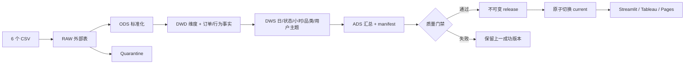

# 电商六表 SQL + DataOps 作品项目

> [!IMPORTANT]
> 当前外部数据的 `source_status = UNVERIFIED`。仓库没有可核验的来源、许可或公司授权信息，数据结构与分布也呈现明显的合成样本特征。因此，本项目只能表述为“基于一组六表电商样本完成工程验证”，**不能称为真实公司、淘宝、阿里或任何企业的生产数据项目**。

这是一个面向数据开发、数仓、BI 与 DataOps 岗位的可复现作品项目。它把用户、商品、订单、行为和两张特征快照表加工为五层 SparkSQL 数仓，并用质量门禁保护最后一个可用的 Dashboard 发布版本。

GitHub Pages 首页刻意只保留标题、4 个 KPI、流程与入口；本 README 承担技术说明和复现证据。

## 30 秒看懂

| 能力 | 仓库证据 |
|---|---|
| SQL 与数仓建模 | `RAW → ODS → DWD → DWS → ADS` 分层 SparkSQL；订单与行为事实分离 |
| 数据质量 | 六表 Schema、主外键、金额公式、生命周期、层间行数与 ADS 指标对账 |
| DataOps | run manifest、输入 SHA-256、quarantine、失败退出、不可变 release 与原子切换 |
| BI 交付 | Streamlit 展示业务指标、运行健康、质量门禁与长期运营模型；8 张小型 ADS CSV 同时服务 Dashboard 与静态作品页 |
| 工程化 | 固定种子 fixture、pytest、统一 `make` 命令和可分享 ZIP |

技术栈：Java 17、PySpark 4.0.3、SparkSQL、本地 Hive Metastore、Parquet、Python、pytest、Streamlit、Tableau-ready CSV。

## 当前可核验结果

最新发布证据以 [`bi_exports/current/manifest.json`](bi_exports/current/manifest.json) 为准。当前仓库中的外部样本运行记录为：

| 项目 | 结果 |
|---|---:|
| 数据模式 / 来源状态 | `PORTFOLIO` / `UNVERIFIED` |
| 六表原始行数 | 59,000 |
| 有效行数 / 隔离行数 | 58,260 / 740 |
| 有效订单 / 有效行为 | 14,526 / 29,734 |
| 完成订单 / 完成购买用户 | 5,868 / 3,461 |
| 完成订单样本金额 | 17.39M（币种未验证，不代表经审计企业收入） |
| 质量检查 | 20 项：16 pass、0 fail、4 warning |

740 行订单或行为发生在用户注册时间之前，已隔离并排除；4 个 warning 还包括金额字段间的未解释差异、特征哨兵值等已知问题。warning 被公开展示，但不会被包装成“高质量真实业务数据”。

## 输入契约

`make full` 接受一个目录，目录中必须有 6 个带表头 CSV，文件名与表头严格匹配：

| 文件 | 粒度 | 用途 |
|---|---|---|
| `users.csv` | 一位注册用户 | 用户维度与注册时间校验 |
| `products.csv` | 一个商品 | 商品、品牌与品类维度 |
| `orders.csv` | 一个源订单 ID | 订单状态、数量、金额与履约事实 |
| `user_behaviors.csv` | 一个行为 ID | 浏览、点击、收藏、加购事件 |
| `user_features.csv` | 一位用户的源特征快照 | 仅用于独立对账，不作为 KPI 来源 |
| `product_features.csv` | 一个商品的源特征快照 | 仅用于独立对账，不作为 KPI 来源 |

完整字段与来源边界见 [`DATASET_NOTICE.md`](DATASET_NOTICE.md)。原始 CSV 不进入 Git、Pages 或作品 ZIP。

两种运行模式：

- `DEMO / SYNTHETIC_FIXTURE`：项目自己生成的固定种子测试数据，用于复现框架。
- `PORTFOLIO / UNVERIFIED`：用户提供的外部六表样本已通过工程门禁，但来源仍未核验。`PORTFOLIO` 不等于“真实公司数据”。

## 数据流



核心业务转换集中在 [`sql/`](sql/)；Python 只负责参数、运行顺序、日志、manifest、质量结果收集与发布。BI 不读取明细表，只消费 `bi_exports/current/` 中的小型汇总文件。

## 复现

要求：macOS、`make`、Python 3.9+、首次安装依赖所需网络，以及足够的本地磁盘空间。

```bash
# 创建虚拟环境、安装锁定依赖，并准备/验证项目本地 JDK 17
make bootstrap

# 生成固定种子六表 fixture，并运行完整数仓
make demo

# 运行自动化测试
make test

# 打开本地 Dashboard
make dashboard
```

运行自己放在仓库外的六表目录：

```bash
make full DATA_DIR=/absolute/path/dataset
```

构建极简 GitHub Pages 页面与可复现 ZIP：

```bash
make pages
make package
```

失败运行返回非零退出码，不能替换 `bi_exports/current/`。详细步骤见 [`REPRODUCE.md`](REPRODUCE.md) 和 [`docs/full_data_runbook.md`](docs/full_data_runbook.md)。

## 指标口径

核心业务数字全部从清洗后的 DWD 事实重算，特征快照不直接供 Dashboard 使用：

- 订单：有效订单数、下单用户、各状态订单数与占比。
- 完成业务：完成订单、完成购买用户、完成订单样本金额、平均完成订单样本金额、完成率。
- 风险状态：取消/退款订单数与占比。
- 客户：重复完成购买用户率、五类互斥客户分群。
- 行为：浏览、点击、收藏、加购的小时分布。
- 品类：商品数、行为、下单/支付/完成用户与订单金额。
- 漏斗：用户级、跨商品的 `浏览 → 点击 → 收藏/加购 → 后续支付订单` 顺序路径。

“完成订单样本金额”是 `order_status = 已完成` 的 `actual_payment` 汇总；代码中的历史字段名 `completed_gmv` 只是技术字段名。源文件没有可验证的币种与会计口径，因此它不能被解释为真实公司的 GMV、收入或财报数字。精确定义见 [`docs/metric_dictionary.md`](docs/metric_dictionary.md)。

## 质量与发布规则

20 项检查包含：

- 六个文件非空且 Schema 精确匹配；
- 六表主键唯一、订单/行为外键完整；
- `RAW = 有效 ODS + quarantine`，以及 ODS/DWD 行数对账；
- `actual_payment = total_amount - discount`；
- 发货、收货时间与订单状态一致；
- 用户/商品特征快照与事实独立聚合对账；
- KPI、每日汇总、顺序漏斗、客户分群和 7 张业务 ADS 非空对账（另有 1 张质量 ADS，共 8 张发布 CSV）；
- 注册前事件、`unit_price × quantity` 差异和特征哨兵值作为 warning 报告。

候选结果先写入独立运行目录。只有所有 critical 检查通过，才固化到 `bi_exports/releases/<run_id>/` 并原子切换 `current`；失败时保留上一版本。

## 可以做与不能做

可以把当前项目用于证明 SQL 分层、事实/维度建模、质量契约、可追溯发布、测试和 BI 交付能力。

不能据此声称：

- 使用了真实公司、淘宝、阿里或任何企业的生产数据；
- 当前金额是企业真实 GMV、收入、利润或财务结果；
- 行为漏斗证明了同一商品的购买归因或因果关系；
- 省市字段足够可靠，可支持地域经营决策；
- `days_since_last_order = 999` 等特征适合建模；
- 本地 Make + Spark 等同企业级调度、权限、Catalog、SLA 与告警平台。

## 文档入口

- [`docs/architecture.md`](docs/architecture.md)：分层、运行生命周期与企业级差距
- [`docs/data_lineage.md`](docs/data_lineage.md)：六表到 ADS 的血缘
- [`docs/metric_dictionary.md`](docs/metric_dictionary.md)：指标、分母和限制
- [`docs/jd_evidence_matrix.md`](docs/jd_evidence_matrix.md)：JD 能力—项目证据矩阵
- [`docs/showcase_and_recording_guide_zh.md`](docs/showcase_and_recording_guide_zh.md)：展示与录屏脚本
- [`docs/resume_bullets.md`](docs/resume_bullets.md)：可诚实使用的简历表述

项目边界不是附注，而是交付的一部分：工程门禁证明“这批数据按项目规则可发布”，不证明数据来源真实或业务结论属于某家公司。
