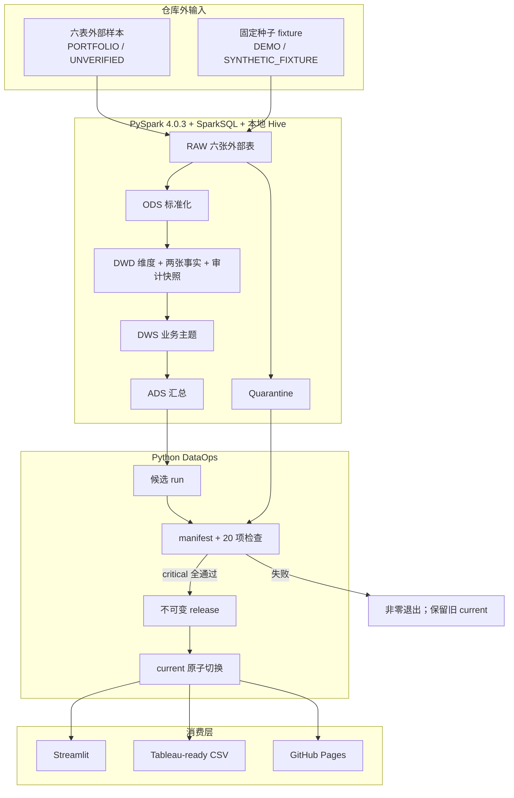
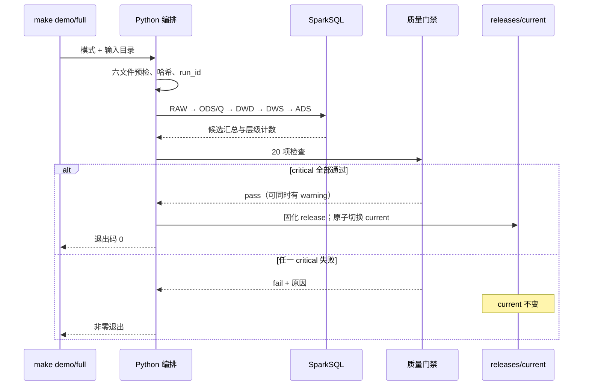

# 架构说明

## 目标

这个本地 MVP 展示如何把六张电商 CSV 转为口径集中、可追溯且失败安全的 BI 数据。它体现企业级 DataOps 原则，但不把本地 Make + Spark 描述为生产平台。

## 设计原则

1. **SQL 管业务口径。** Python 负责参数、运行顺序、日志、manifest 与发布。
2. **订单与行为分事实。** 购买来自订单表；行为表只有浏览、点击、收藏和加购。
3. **源特征只审计。** 两张 features 表用于对账，不直接提供 KPI。
4. **先验证再发布。** critical 检查全部通过后才能切换 BI 当前版本。
5. **来源状态独立于质量状态。** `quality = pass` 不能把 `source_status = UNVERIFIED` 变成真实公司数据。

## 组件与数据流



## 分层职责

| 层 | 代表数据集 | 粒度 |
|---|---|---|
| RAW | `raw_*_external`、`raw_*_contract` | 源文件一行 |
| ODS | `ods_users_valid`、`ods_products_valid`、`ods_orders_valid`、`ods_user_behaviors_valid`、两张 feature valid 表、`ods_quarantine` | 一条有效或被隔离的源记录 |
| DWD | `dwd_dim_user`、`dwd_dim_product`、状态/行为/日期维度、`dwd_fact_order`、`dwd_fact_behavior`、两张审计快照 | 一个维度成员、订单或行为 |
| DWS | 每日交易、订单状态、小时行为、客户汇总/分群、顺序漏斗、品类表现 | 每个主题声明的聚合粒度 |
| ADS | KPI、趋势、漏斗、品类、小时、分群、订单状态、质量 | Dashboard 可直接读取的一行汇总 |

物理表和最终字段以 [`sql/`](../sql/) 为准，指标解释以[指标字典](metric_dictionary.md)为准。

## 运行生命周期



manifest 绑定 run ID、模式、来源状态、六文件哈希、SQL bundle 哈希、Spark 版本、数据行数、日期范围、导出行数、质量状态与耗时。

## BI 接口

```text
bi_exports/current/
├── manifest.json
├── ads_executive_kpis.csv
├── ads_daily_trend.csv
├── ads_order_status.csv
├── ads_hourly_behavior.csv
├── ads_category_performance.csv
├── ads_customer_segments.csv
├── ads_sequential_funnel.csv
└── ads_dataops_health.csv
```

前端不直接访问 Hive 明细。这样业务口径只计算一次，Dashboard 只读取小型、已发布的汇总接口。

## 失败语义

| 失败 | 行为 |
|---|---|
| 缺文件、表头或列宽错误 | Spark 建模前失败 |
| 主键、外键、金额公式或生命周期 critical 失败 | 候选结果不发布 |
| 注册前订单/行为 | 行进入 quarantine；质量报告显示 warning |
| 特征哨兵或未解释金额差异 | 明确 warning，不作为 KPI 输入 |
| Spark/Java 中断 | 当前成功版本不变 |
| Dashboard 缺契约文件 | 明确报错，不猜测或补零 |

## 与企业级 DataOps 的差距

典型企业环境还会提供对象存储与 ACID 表格式、Catalog/字段级血缘、多环境发布、Airflow/DataWorks 等调度、重试补数、RBAC、密钥管理、SLA/SLO、集中日志与告警、成本和容量治理。本项目只实现其中可在本机验证的核心原则：数据契约、分层 SQL、幂等批次、质量门禁、审计证据与最后成功版本保护。

## 风险

- 外部样本来源未验证且疑似合成，不能归属任何真实公司。
- 省市组合和部分特征字段不可靠，已从对外分析中排除。
- 顺序漏斗是用户级跨商品路径，不是同商品归因。
- 源金额币种未验证，只支持样本内部口径，不代表经审计 GMV、收入或利润。
- 静态状态快照不能替代完整订单状态历史，也不能证明因果关系。
