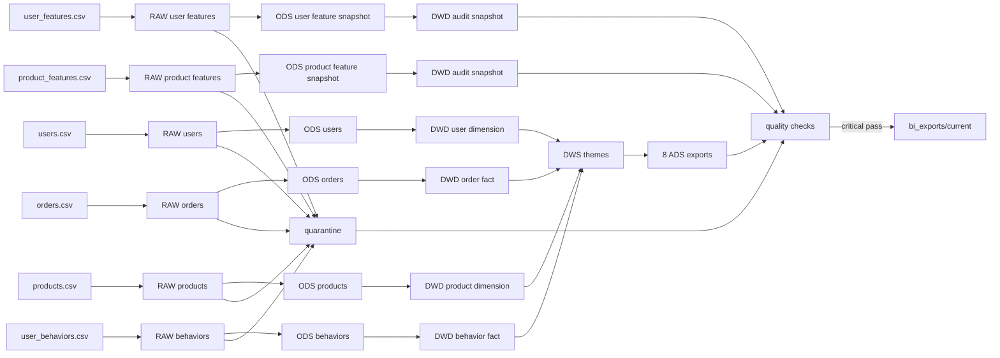

# 数据血缘

## 端到端血缘



## 源表到事实/维度

| 源表 | 关键键 | DWD 去向 | 说明 |
|---|---|---|---|
| users | `user_id` | `dwd_dim_user` | 注册日期参与时序质量检查；省市不用于当前经营分析 |
| products | `product_id` | `dwd_dim_product` | 提供商品、品牌、品类和目录价格 |
| orders | `order_id`，FK `user_id/product_id` | `dwd_fact_order` | 一行按一个源订单 ID；状态决定支付生命周期与完成口径 |
| user_behaviors | `behavior_id`，FK `user_id/product_id` | `dwd_fact_behavior` | 浏览、点击、收藏、加购；不含购买 |
| user_features | `user_id` | `dwd_feature_snapshot_user` | 审计快照，只和事实重算结果对账 |
| product_features | `product_id` | `dwd_feature_snapshot_product` | 审计快照，只和事实重算结果对账 |

ODS 为每张表完成类型转换、枚举检查、主外键准备与拒绝原因记录。订单或行为时间早于注册日期的记录进入统一 `ods_quarantine`，不进入事实表。

## 主要派生字段

| 字段 | 来源与规则 | 用途 |
|---|---|---|
| `status_code/status_order` | 中文订单状态映射为稳定英文代码与顺序 | 状态展示与排序 |
| `is_paid_lifecycle` | 已付款、已发货、已收货、已完成 | 支付生命周期订单/用户/金额 |
| `is_completed` | 状态为已完成 | 完成订单与完成金额 |
| `paid_gmv` | 支付生命周期时取 `actual_payment`，否则 0 | 样本内部支付金额汇总 |
| `behavior_code` | 浏览/点击/收藏/加购映射为英文代码 | 小时行为与顺序漏斗 |
| `order_date/behavior_date` | 由时间戳取自然日 | 日期维度和趋势 |
| `behavior_hour` | 行为时间的 0–23 小时 | 小时分布 |
| `age_band` | 用户年龄分段 | 可复用用户维度；当前首页不展示 |

`paid_gmv` 等是代码中的技术字段名，不是对来源或会计性质的背书。

## 指标级血缘

| Dashboard 区域 | ADS 文件 | 直接上游 | 核心事实字段 |
|---|---|---|---|
| KPI | `ads_executive_kpis.csv` | 订单/行为事实、用户/商品维度、quarantine | `order_id`、状态、`actual_payment`、`user_id` |
| 每日趋势 | `ads_daily_trend.csv` | `dws_daily_commerce` | `order_date`、状态、金额 |
| 订单状态 | `ads_order_status.csv` | `dws_order_status_summary` | 状态、用户、金额 |
| 小时行为 | `ads_hourly_behavior.csv` | `dws_hourly_behavior` | 行为类型、小时、时长 |
| 品类表现 | `ads_category_performance.csv` | 订单/行为事实 + 商品维度 | `category`、订单状态、金额、行为 |
| 客户分群 | `ads_customer_segments.csv` | `dws_customer_summary` | 用户级订单/支付/行为计数 |
| 顺序漏斗 | `ads_sequential_funnel.csv` | 两张事实的用户级首次时间 | 浏览、点击、意向、后续支付时间 |
| DataOps Health | `ads_dataops_health.csv` + manifest | 六层计数与不变量 | check、哈希、run 元数据 |

## 发布血缘

```text
六文件 SHA-256 + SQL bundle SHA-256
  └─ run_id
      ├─ Hive/Parquet 分层
      ├─ quarantine
      ├─ 候选 ADS CSV
      ├─ 质量检查
      └─ manifest
          └─ critical 全通过
              └─ releases/<run_id>
                  └─ current 原子切换
```

`bi_exports/current` 是 BI 默认接口，不是临时工作目录。失败批次不能修改它。

## 对账不变量

```text
每张 RAW 行数 = 对应有效 ODS 行数 + 对应 quarantine 行数
有效订单 ODS = DWD 订单事实
有效行为 ODS = DWD 行为事实
六张业务主键无重复
订单/行为用户与商品外键完整
actual_payment = total_amount - discount
五个客户分群互斥且覆盖全部注册用户
四级顺序漏斗人数单调不增
ADS KPI = DWD 独立重算结果
```

## 不进入业务血缘的字段

- 省市：当前组合质量不足，不做地域结论。
- `days_since_last_order`：存在大量 `999` 哨兵值。
- features 表的预计算转化、意向、消费等级等：只保留审计，不替代事实重算。
- `unit_price × quantity`：与 `total_amount` 的差异缺少业务说明，只报告 warning。

来源真实性也不由血缘推导。血缘证明的是“一个数字如何从当前输入计算出来”，不是“输入属于哪家公司”。
