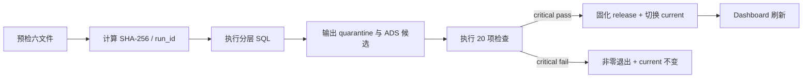

# 求职展示与录屏指南

## 展示原则

招聘方首页只回答四件事：做了什么、核心结果、流程是否可信、去哪里继续看。不要把 README 全部搬到首页。

推荐首页结构：

1. 一句话标题；
2. 4 个 KPI：有效订单、完成订单样本金额、完成购买用户、订单完成率；
3. 一条 `6 CSV → SparkSQL warehouse → Quality gates → BI` 流程；
4. 一行 `PORTFOLIO / UNVERIFIED` 来源声明；
5. “查看 Dashboard”和“查看代码”两个入口。

详细 Schema、限制和复现命令留在 README，不在首页重复。

## 给零基础观众的五分钟顺序

| 时间 | 画面 | 讲什么 | 证明什么 |
|---:|---|---|---|
| 0:00–0:30 | 极简首页 | 六表电商样本经过 SQL 与质量门禁成为 BI；来源未验证 | 定位与诚信 |
| 0:30–1:30 | Dashboard KPI + 趋势 | 有效订单、完成金额、完成用户、完成率；全部来自同一 ADS | 指标与 BI |
| 1:30–2:20 | 状态、品类、小时、分群 | 每张图回答一个问题，不堆图 | 分析表达 |
| 2:20–3:10 | 架构图 | RAW→ODS→DWD→DWS→ADS；订单/行为双事实 | 数仓建模 |
| 3:10–4:10 | DataOps Health + manifest | 20 项检查、740 隔离行、0 fail、4 warning、哈希与 run ID | 质量与审计 |
| 4:10–5:00 | 失败保护测试 | 坏批次不能覆盖上一成功版本；说明企业级差距 | DataOps 与边界 |

结束语：

> 这个项目证明我能把原始多表数据变成口径一致、可测试、可追溯且失败安全的数据产品；数据来源仍是未验证样本，所以我展示工程能力，不把结果包装成真实公司业绩。

## 可视化数量

对外主页面保持 4 个数字，不堆图。交互 Dashboard 保留 5–7 个业务视图和 1 个质量视图即可：

| 视觉 | 问题 |
|---|---|
| KPI 卡 | 样本规模和完成表现怎样？ |
| 每日趋势 | 订单与完成金额如何变化？ |
| 订单状态 | 各状态结构怎样？ |
| 品类表现 | 哪些品类的完成金额较高？ |
| 小时行为 | 浏览、点击、收藏、加购集中在哪些小时？ |
| 客户分群 | 重复支付、单次支付、未支付、只参与、未活跃结构怎样？ |
| DataOps Health | 当前批次能否发布，有哪些 warning？ |

顺序漏斗可作为技术下钻，而不是首页主结论，因为它是跨商品用户级路径，解释成本较高。

## 录屏方案

推荐两条视频：

- **招聘版 5–7 分钟**：首页、Dashboard、架构、质量、边界。
- **技术版 10–12 分钟**：再加入 SQL、manifest、测试和失败保护。

### 录制前

1. 关闭通知、邮件、聊天和密码管理器弹窗。
2. 终端字号至少 16 px；不展示个人绝对路径、Cookie、Token 或原始明细。
3. 先完成 `make bootstrap`，避免视频被依赖下载打断。
4. 准备首页、Dashboard、架构文档、manifest 和质量 CSV 五个标签页。
5. 所有数字使用同一个 run ID。

### 招聘版镜头

1. 首页：20 秒讲项目定位和 `UNVERIFIED`。
2. Dashboard：90 秒讲 4 个 KPI 与 3–4 张关键图。
3. 架构：60 秒讲五层、双事实、feature audit-only。
4. 质量：60 秒讲 20 项检查、quarantine、warning。
5. 失败安全：60 秒展示坏批次后 `current` 不变。
6. 结尾：30 秒说明复现命令和企业级差距。

### 技术版增加

- [`sql/10_ods.sql`](../sql/10_ods.sql)：标准化与 quarantine。
- [`sql/20_dwd.sql`](../sql/20_dwd.sql)：订单/行为事实与维度。
- [`sql/31_dws_users.sql`](../sql/31_dws_users.sql)：客户分群和顺序漏斗。
- [`sql/90_quality.sql`](../sql/90_quality.sql)：critical 与 warning。
- [`bi_exports/current/manifest.json`](../bi_exports/current/manifest.json)：输入、SQL、质量、耗时证据。

公开命令：

```bash
make demo
make test
make dashboard
make recording-demo
```

不要在录屏中展示仓库外的六张原始 CSV。

## DataOps 录屏要证明的完整流程



最有说服力的不是滚动大量日志，而是同时展示：成功 run ID、质量结果、失败退出码、失败前后 `current` 校验和相同。

## 企业级对照

| 维度 | 本项目 | 典型企业 |
|---|---|---|
| 来源 | 六张本地 CSV | CDC、API、对象存储、消息队列等多源 |
| 计算 | 单机 SparkSQL | 弹性集群、湖仓、资源队列 |
| 编排 | Make + Python | Airflow/DataWorks/Dagster/Argo，重试补数与依赖管理 |
| 存储 | 本地 Hive + Parquet | S3/OSS/HDFS + Iceberg/Delta/Hudi + Catalog |
| 质量 | 20 项项目门禁 | 规则平台、异常基线、跨系统对账、SLA |
| 发布 | 不可变目录 + 原子链接 | ACID 快照、多环境晋级、蓝绿/回滚 |
| 可观测 | manifest、日志、质量 CSV | 指标/日志/Tracing、告警、值班 |
| 安全 | 原始数据不入包 | IAM、最小权限、密钥、审计、分级脱敏 |

面试推荐说法：

> 我在本地实现的是企业 DataOps 的核心控制点，不是完整平台。迁移到企业环境时，我会保留 SQL 口径和质量契约，把本地编排、存储和发布映射到组织已有的调度、湖仓、Catalog、权限和告警体系。

## 分享包

```bash
make package
```

ZIP 应包含源码、SQL、测试、文档、ADS 汇总与 manifest；不包含原始 CSV、依赖环境、运行缓存、密钥或 Git 历史。评审者解压后可运行：

```bash
make bootstrap
make demo
make test
make dashboard
```

任何公开页面、视频、简历和 ZIP 都必须保留：当前外部数据来源未验证、疑似合成、不能归属真实公司。
